# Neural Style Transfer - vanilla version

This repo contains a simple `~100` LoC implementation of the _Neural Style Transfer_ paper by Gatys et al. 

  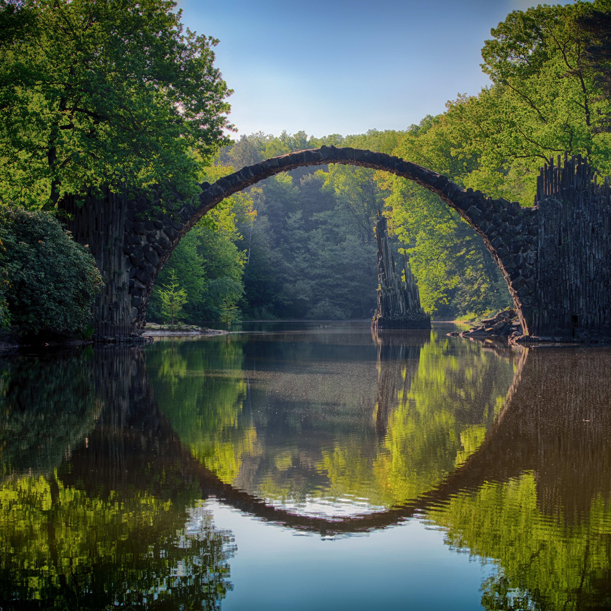 + 
  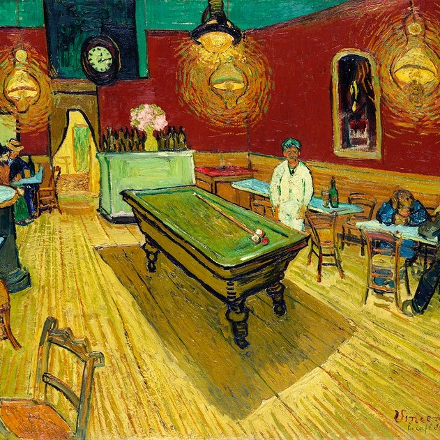 = 
  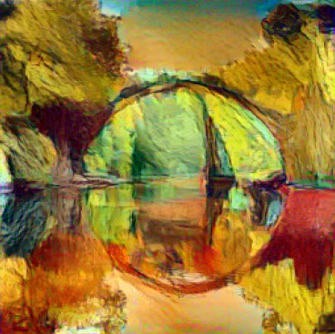

# Original Paper's Idea
We want to extract/learn the texture features of an style image and subsequently embed it into a target image. Then this algorithm allows us to produce new images that combine the content of an arbitrary photograph with the appearance of numerous well known artworks.

# Results
Some beautiful results:

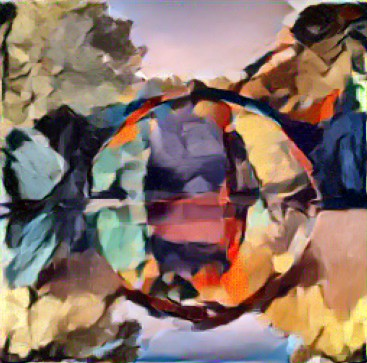
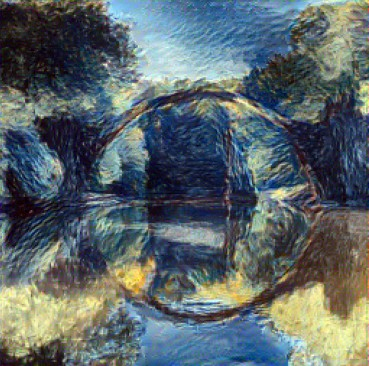

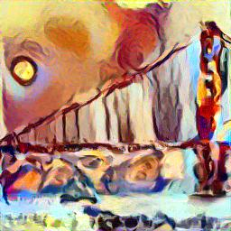

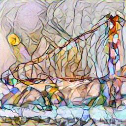

Because of memory issues I had to resize the images to 256x256, but I suspect that better results can be achieved by leaving the images as 512x512 as more details can be learned.

# What I did? 
### Content Reconstruction
By using learning transfer from a VGG19 net we can get deep feature representations of the target image, whose details can be reconstructed from a white image. While shallow layers gets almost perfect reconstruction of the image, deeper layers lose detailed pixel information.

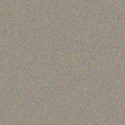
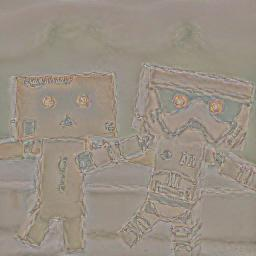
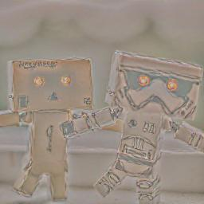
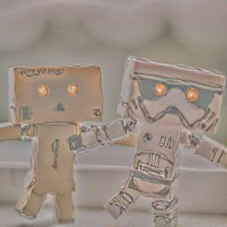

### Style/Texture Extraction
For the style extraction we don't want to keep details about the artwork but instead have an overall understanding of the texture/style. This is where _Gram matrices_ come into play as the texture model needs to be agnostic to spacial information. See what happens for the artwork of _Starry Night_ by Vincent van Gogh:

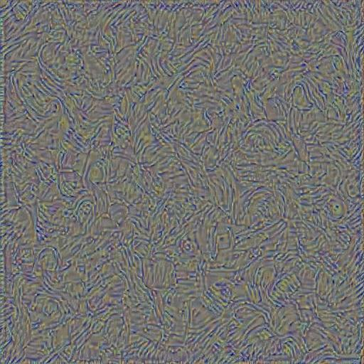
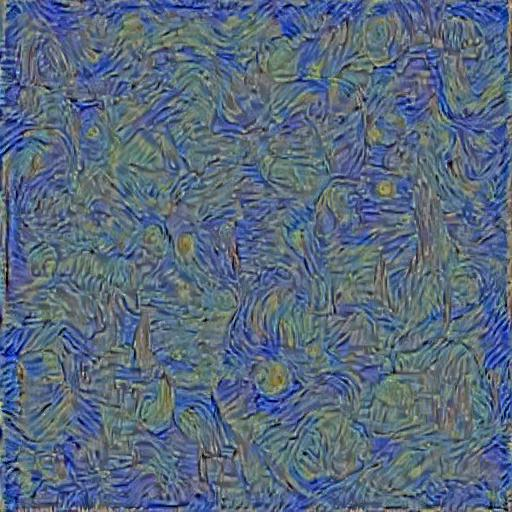
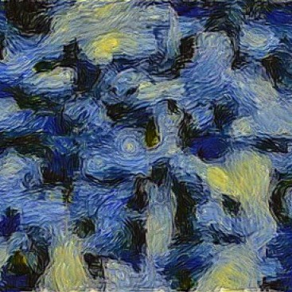

In my case the ratio of $\alpha/\beta=1/70$ or $\alpha/\beta=1/100$ and a number of epochs around $1e3$ worked best. 

### About the code
The code is not so refined, but because of the number of LoC ($\sim 100$), I think is easy to follow what I did. For the code to work in your computer, you may have to change some file directions and experiment a bit.

---
#### Helpful resources

- Check the original paper https://arxiv.org/abs/1508.06576
- This project was a suggestion by @gordicaleksa as an intermediate level project. See his [youtube channel](https://www.youtube.com/watch?v=S78LQebx6jo&pp=ygUdYWxla3NhIGdvcmRpYyBzdHlsZSB0cmFuc2ZlciA%3D)
