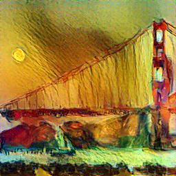

<h1 style="text-align: center;">Neural Style Transfer</h1>
This [repo](https://github.com/TAOGenna/pytorch-neural-style-transfer) contains a simple ~100 LoC implementation of the _Neural Style Transfer_ paper by Gatys et al. 

# Original Paper's Idea

We have an style image whose texture we want to extract and subsequently embed it into a target image. Using CNNs (usually a Vgg-16/19) this algorithm allows us to produce new images that combine the content of an arbitrary photograph with the appearance of numerous well known artworks.

# Examples

Because of memory issues I had to resize the images to 256x256, but I suspect that better results can be achieved by leaving the images as 512x512 as more details can be learned.

# Content Reconstruction
By using tranfer learning from a VGG19 net we can get deep feature representations of the target image, whose details can be reconstructed from a white image (i.e. white noise or a gaussian noise). While shallow layers gets almost perfect reconstruction of the image, deeper layers lose detailed pixel information. The stand alone code to play with content reconstruction can be found in the file `content_reconstruction.ipynb`.

# Style/Texture Extraction
For the style extraction we don't want to keep details about the artwork but instead have an overall understanding of the texture/style. This is where _Gram matrices_ come into play as the texture model needs to be agnostic to spacial information. See what happens for the artwork of _Starry Night_ by Vincent van Gogh:

# Usage 
- Clone repository
- Change directions of `project_dir = '/home/rotakagui/projects/pytorch-neural-style-transfer'` in the `neaural_style_transfer.ipynb`
- That's about it

# Acknowledgements

- Original paper https://arxiv.org/abs/1508.06576
- This project was a suggestion by @gordicaleksa as an intermediate level project. See his [channel](https://www.youtube.com/watch?v=S78LQebx6jo&pp=ygUdYWxla3NhIGdvcmRpYyBzdHlsZSB0cmFuc2ZlciA%3D)